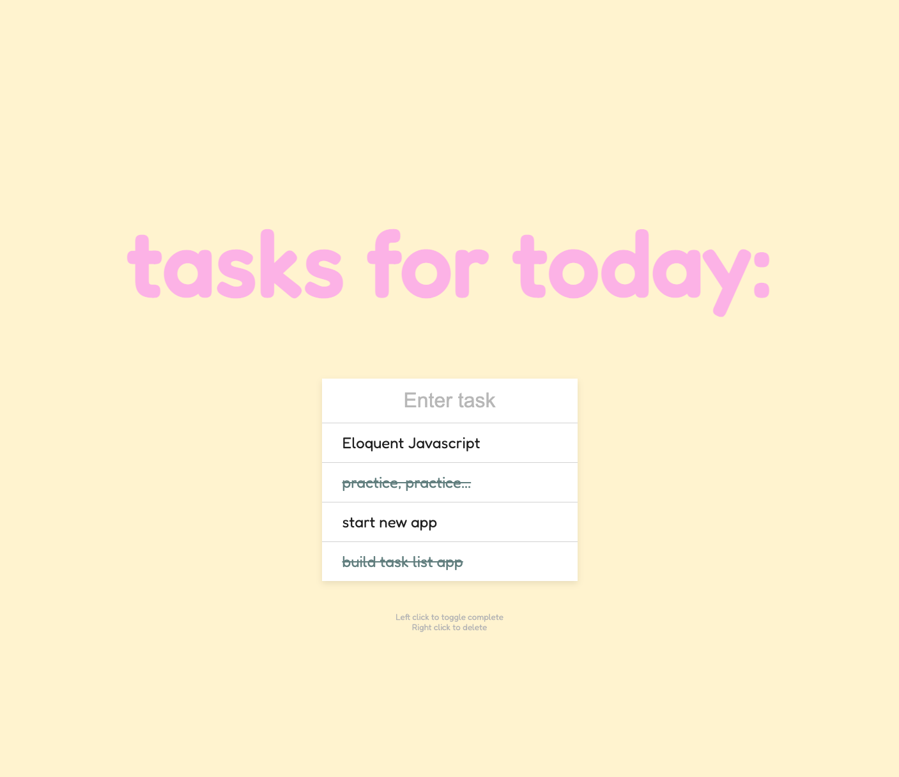

# Task Reminder JS

## **Description**
Created a task list using Vanilla JS that clicks completed tasks, deletes tasks and saves/updates to localStorage. I wanted to create this in Javascript before creating a task list in React to make sure I understand the functionality.

## **Table of Contents**
* [Installation](#installation)
* [Usage](#usage)
* [Licenses](#licenses)
* [Badges](#Badges)
* [Questions](#questions)

### **Installation**
no installation needed

### **Usage**

### **Technologies Used:**
 HTML
 CSS
 Javascript

### *Licenses*
MIT license

### *Badges*

### *Questions*
If you have any questions, reach out to me on Git Hub https://github.com/JJLindsey, or send me a message jlindsey010@gmail.com.

©Jennifer Lindsey 2021
